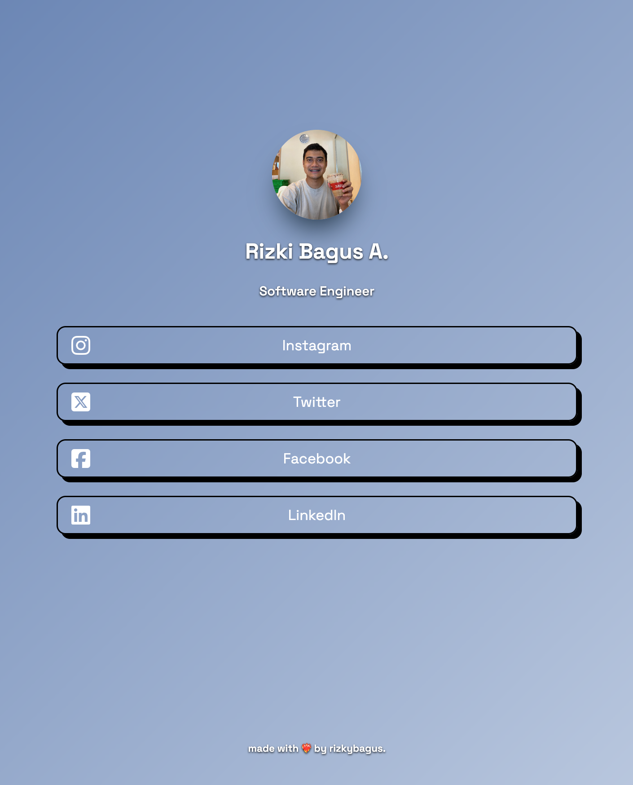

# My Linktree

A simple and modern personal linktree page built using HTML and CSS. This project serves as a centralized place to showcase social media links and contact information.

## Preview



## Features

- Responsive design
- Soft gradient background
- Animated hover effects on buttons
- Contact email integration
- Simple and lightweight

## Technologies Used

- HTML5
- CSS3
- Font Awesome for icons
- Google Fonts (Space Grotesk)

## Installation

1. Clone this repository:
   ```bash
   git clone https://github.com/yourusername/linktree.git
   ```
2. Navigate to the project directory:
   ```bash
   cd linktree
   ```
3. Open `index.html` in your browser.

## Usage

- Replace the profile image in `./images/image-600x600.jpg` with your own.
- Update the `index.html` file with your social media links and contact details.
- Customize the `style.css` file for further styling changes.

## Contact

If you have any questions or suggestions, feel free to contact me:

- Email: [rbagus306@gmail](mailto:rbagus306@gmail.com)
- LinkedIn: [Rizki Bagus A.](https://www.linkedin.com/in/rizkibagusa/)

---

Made with ❤️‍🔥 by Rizki Bagus A.
